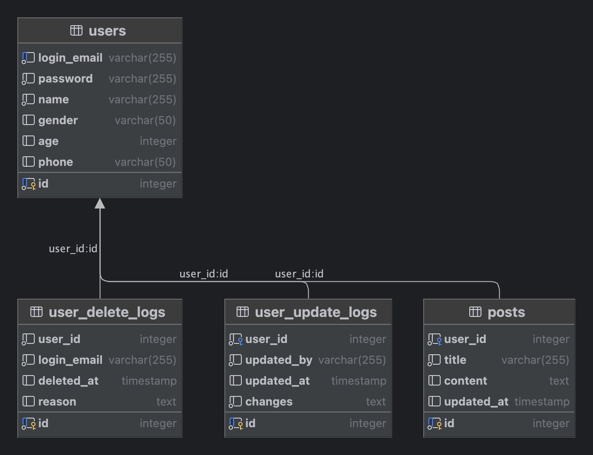

## 1. 프로젝트 실행 가이드
### 1-1. 설치 요소 설명 및 설치 방법(macOS 기준)
- **Docker**: 컨테이너 기반 가상화 플랫폼
    ```shell
    # Docker 설치 여부 확인
    docker --version
  
    # Docker 설치
    brew install docker
  
    # Docker 실행
    open /Applications/Docker.app
    ```
- **Python(3.9 이상)**: 파이썬 프로그래밍 언어
    ```shell
    # Python 설치 및 버전 확인
    python3 --version
  
    # Python 설치
    brew install python@3.9
    ```
- **PostgreSQL**: 오픈소스 객체-관계형 데이터베이스 시스템
    ```shell
    # PostgreSQL 설치 여부 확인
    psql --version
  
    # PostgreSQL 설치
    brew install postgresql
  
    # PostgreSQL 실행
    brew services start postgresql
    ```

### 1-2. App 실행방법(모든 앱은 아래 프로세스로 한번에 실행됩니다)
Docker를 활성화 시킨 상태에서 아래 코드를 순서대로 실행해주세요.(macOS 기준)

```bash
# TEST 코드 실행을 위해 venv를 이용하여 가상환경 생성
python3 -m venv venv

# 가상환경 활성화
source venv/bin/activate

# pip를 이용하여 가상환경 내 필요한 API 설치
pip install -r requirements.txt

# 파일에 실행권한 부여
chmod +x deploy.sh

# 배포 스크립트 실행(테스트 성공 시에만 docker-compose로 배포)
./deploy.sh
```

### 1-3. API 명세서(Swagger-UI)
각 서비스는 아래 API 명세서를 통해 확인 및 테스트할 수 있습니다.

* 회원가입 및 로그인을 위한 백엔드 서비스: http://localhost:8001/docs
* 이용자 백엔드 서비스: http://localhost:8002/docs
* 게시판 백엔드 서비스: http://localhost:8003/docs
<br/><br/>


## 2. 테스트 시나리오 계획
deploy.sh 스크립트를 실행하면 다음과 같은 시나리오 테스트를 수행 후 성공할 경우에만 배포
각각에 대한 테스트는 API 명세를 해둔 Swagger-UI를 이용하여 수행할 수도 있습니다.

### 시나리오 1: 유저 등록 후 로그인 시도
1. `POST /auth/register`로 유저 등록
2. 필수 필드 누락 테스트: `POST /auth/register`에서 필수 필드 누락 시 올바른 오류 응답 반환 확인
3. 이미 존재하는 사용자로 회원가입 시도 테스트: `POST /auth/register`로 이미 존재하는 사용자로 회원가입 시도 시 올바른 오류 응답 반환 확인
3. 등록한 유저 정보로 `POST /auth/login` 시도
4. 유효하지 않은 자격증명으로 `POST /auth/login` 시도
5. 만료된 토큰으로 요청 시도: 만료되거나 잘못된 토큰으로 API 요청 시 올바른 인증 오류 응답 확인

### 시나리오 2: 게시글 CRUD 테스트
1. `POST /posts`로 게시글 작성
2. `GET /posts`로 게시글 목록 조회
3. `GET /posts/{post_id}`로 특정 게시글 조회
4. 잘못된 post_id로 조회 시도: 존재하지 않는 `post_id`로 `GET /posts/{post_id}` 요청 시 오류 응답 확인
5. `PUT /posts/{post_id}`로 게시글 수정
6. 잘못된 post_id로 수정 시도: 존재하지 않는 `post_id`로 `PUT /posts/{post_id}` 요청 시 오류 응답 확인

### 시나리오 3: 유저 CRUD 테스트
1. `POST /users`로 새로운 유저 생성
2. `PUT /users`로 유저 정보 수정
3. 존재하지 않는 유저 정보 수정 시도: 존재하지 않는 유저의 정보를 수정할 때 오류 응답 확인
4. `DELETE /users`로 유저 삭제
5. 삭제 후 `GET /users`로 삭제된 유저 조회 시도
<br/><br/>

## 3. ERD 설계
### 3-1. ERD 설명
서비스의 데이터베이스 구조는 다음과 같은 주요 테이블로 구성됩니다.

1. **users 테이블**
   - 설명: 기본 사용자 정보를 저장합니다. 사용자명과 비밀번호, 그리고 사용자의 이름, 성별, 나이, 전화번호 등의 정보를 포함합니다.
   - 주요 컬럼:
      - `id`: 사용자 고유 식별자 (Primary Key)
      - `login_email`: 사용자명 (Unique, 필수)
      - `password`: 비밀번호 (필수)
      - `name`: 사용자 이름 (필수)
      - `gender`: 성별
      - `age`: 나이
      - `phone`: 전화번호
      - `last_login_at`: 마지막 로그인 시각
      - `created_at`: 사용자 생성 시각 (자동으로 현재 시간 설정)
2. **user_update_logs 테이블**
   - 설명: 사용자 정보 수정 이력을 저장합니다. 어떤 사용자가 언제 누구에 의해 수정되었는지 기록하며, 변경된 내용을 포함합니다.
   - 주요 컬럼:
      - `id`: 수정 이력 고유 식별자 (Primary Key)
      - `user_id`: 수정된 사용자 ID (Foreign Key)
      - `updated_by`: 수정 작업을 수행한 사용자
      - `updated_at`: 수정된 시각 (자동으로 현재 시간 설정)
      - `changes`: 변경된 내용 (필수)
3. **user_delete_logs 테이블**
   - 설명: 사용자 삭제 이력을 저장합니다. 사용자가 삭제될 때, 삭제를 수행한 사용자와 삭제된 이유를 기록합니다.
   - 주요 컬럼:
      - `id`: 삭제 이력 고유 식별자 (Primary Key)
      - `user_id`: 삭제된 사용자 ID
      - `login_email`: 삭제된 사용자 이메일
      - `deleted_at`: 삭제된 시각 (자동으로 현재 시간 설정)
      - `reason`: 삭제 사유
4. **posts 테이블**
   - 설명: 게시글 정보를 저장합니다. 게시글의 제목, 내용, 작성자 및 마지막 수정 시간을 포함합니다.
   - 주요 컬럼:
      - `id`: 게시글 고유 식별자 (Primary Key)
      - `user_id`: 작성자 ID (Foreign Key)
      - `title`: 게시글 제목 (필수)
      - `content`: 게시글 내용
      - `updated_at`: 마지막 수정 시각 (자동으로 현재 시간 설정)

### 3-2. ERD 다이어그램

<br/><br/>